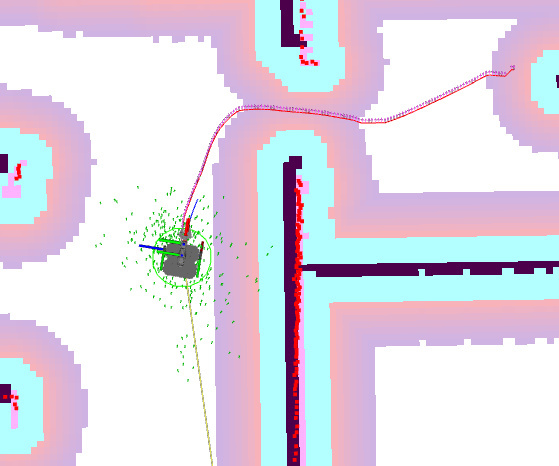
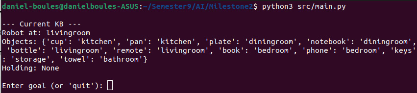
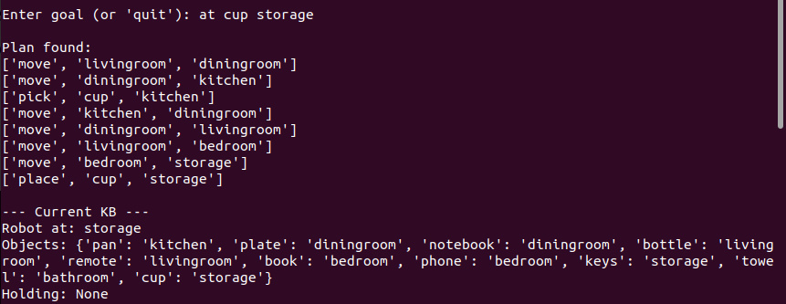
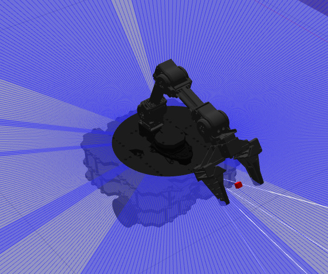
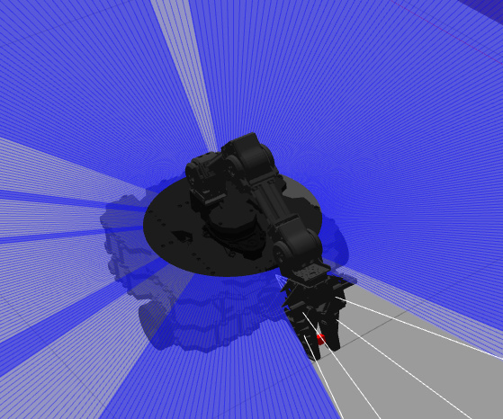
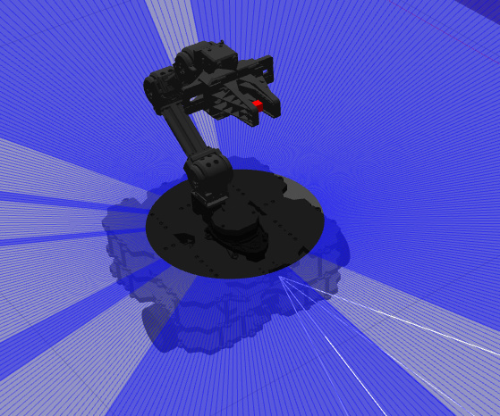

# TurtleBot3 AI Service Robot

[](LICENSE)
[](https://docs.ros.org/en/humble/)
[](https://www.python.org/)

An AI-powered service robot that combines **ROS 2 navigation and manipulation** with **PDDL-based task planning**. A TurtleBot3 with an OpenManipulator gripper navigates a simulated apartment in Gazebo, autonomously picking and placing objects across six rooms based on high-level goal specifications.

> **Paper** — *Integrated Symbolic Planning and Robotic Execution: A PDDL-Based Task Planner with ROS 2 and Gazebo* ([PDF](docs/AI_Robotics_Planning.pdf))

<p align="center">
  
</p>
<p align="center"><em>Navigation in RViz: global planner (red line) generates a path from Dining Room to Kitchen, overlaid on the costmap with LIDAR scan (green).</em></p>

---

## Table of Contents

- [Architecture](#architecture)
- [Results](#results)
- [Repository Layout](#repository-layout)
- [Prerequisites](#prerequisites)
- [Usage](#usage)
- [World Model](#world-model)
- [Authors](#authors)
- [References](#references)
- [License](#license)

---

## Architecture

The system has three layers:

1. **PDDL Planning** — A CLI accepts high-level goals (e.g. `at cup storage`), generates PDDL, and invokes [Fast Downward](https://www.fast-downward.org/) (A* + LM-Cut heuristic) to produce an optimal action plan.
2. **Executor** — Translates each planned action (`move`, `pick`, `place`) into ROS 2 commands by launching the appropriate node with the correct parameters.
3. **ROS 2 Nodes** — `navigation_node` sends goal poses via Nav2 (0.30 m tolerance), and `gripper_node` controls the OpenManipulator arm and gripper through action clients.

### PDDL Domain

Three action schemas define the planning operators:

- **Move(from, to)** — Preconditions: `robot-at(from)`, `connected(from,to)`. Effects: `robot-at(to)`, `¬robot-at(from)`.
- **Pick(obj, room)** — Preconditions: `robot-at(room)`, `at(obj,room)`, `handempty`. Effects: `holding(obj)`, `¬at(obj,room)`, `¬handempty`.
- **Place(obj, room)** — Preconditions: `robot-at(room)`, `holding(obj)`. Effects: `at(obj,room)`, `¬holding(obj)`, `handempty`.

The Knowledge Base (KB) is updated in **closed-loop** fashion — symbolic state changes only after confirmed physical execution, preventing plan-reality divergence.

### ROS 2 Interfaces

| Component | Type | Topic / Action |
|-----------|------|----------------|
| Navigation | Action Client | `/navigate_to_pose` |
| Arm Control | Action Client | `/arm_controller/follow_joint_trajectory` |
| Gripper | Action Client | `/gripper_controller/gripper_cmd` |

---

## Results

### Planning CLI

<p align="center">
  
</p>
<p align="center"><em>CLI interface showing the initial KB state: robot in the living room, 10 objects distributed across 6 rooms.</em></p>

<p align="center">
  
</p>
<p align="center"><em>Plan execution for goal "at cup storage": 7-step sequence (move → pick → move → place) traversing multiple rooms. KB updated after each successful action.</em></p>

### Manipulation Sequence

Object manipulation follows a three-phase sequence validated in Gazebo:

<p align="center">
  &emsp;
  &emsp;
  
</p>
<p align="center"><em>Three-phase manipulation: (a) arm lowers to approach, (b) gripper actuates (open/close), (c) arm returns to safe home pose for driving.</em></p>

### End-to-End Task Completion

The integrated system was tested with the goal `at cup storage`, requiring:
- Navigation across **4 rooms** (living room → dining room → kitchen → … → storage)
- One **pick** action in the kitchen and one **place** action in storage
- KB updated **only after** each physical action succeeds

---

## Repository Layout

```
├── planning/
│   ├── src/               # Planning CLI and PDDL pipeline
│   │   ├── main.py        # Entry point — boots world, KB, CLI
│   │   ├── world_model.py # 6-room apartment model with object placement
│   │   ├── kb.py          # In-memory knowledge base (robot/object state)
│   │   ├── pddl_generator.py  # Emits domain + problem PDDL from KB
│   │   ├── planner.py     # Calls Fast Downward solver
│   │   ├── executor.py    # Bridges PDDL actions → ROS 2 commands
│   │   └── utils.py       # Plan parsing helpers
│   ├── domain/            # PDDL domain (move / pick / place actions)
│   ├── problems/          # Generated PDDL problem files
│   ├── output/            # Planner output artifacts
│   └── README.md
├── ros/
│   ├── tb3_service_robot/   # ROS 2 Python package
│   │   └── tb3_service_robot/
│   │       ├── navigation_node.py  # Nav2 goal sender
│   │       └── gripper_node.py     # OpenManipulator arm + gripper control
│   └── tb3_course_assets/ # Custom Gazebo world, map, and models
│       ├── maps/          # SLAM-generated occupancy grid
│       ├── models/        # Custom house model for Gazebo
│       └── worlds/        # Gazebo world file
└── docs/
    ├── AI_Robotics_Planning.pdf   # IEEE conference paper
    ├── Course_Report.pdf          # Original course report
    └── figures/                   # Extracted paper figures
```

## Prerequisites

| Dependency | Notes |
|---|---|
| **ROS 2 Humble** | With `nav2_simple_commander`, `control_msgs`, `geometry_msgs` |
| **TurtleBot3 packages** | [`turtlebot3_simulations`](https://github.com/ROBOTIS-GIT/turtlebot3_simulations), `turtlebot3_manipulation_*` |
| **Gazebo** | Classic (ROS 2 Humble default) |
| **Fast Downward** | [github.com/aibasel/downward](https://github.com/aibasel/downward) — build and add to `PATH` |
| **Python 3.8+** | For the planning CLI |

## Usage

**1. Launch the simulation environment**

```bash
# Terminal 1 — Gazebo with TurtleBot3 + OpenManipulator
ros2 launch turtlebot3_manipulation_gazebo gazebo.launch.py

# Terminal 2 — MoveIt servo for arm control
ros2 launch turtlebot3_manipulation_moveit_config servo.launch.py

# Terminal 3 — Nav2 with the custom map
ros2 launch turtlebot3_manipulation_navigation2 navigation2.launch.py \
  map_yaml_file:=$HOME/<path-to-repo>/ros/tb3_course_assets/maps/map.yaml
```

**2. Run the planning CLI**

```bash
# Terminal 4
cd planning
python3 src/main.py
```

**3. Enter goals at the prompt**

```
> robot-at kitchen
> at cup bedroom
> holding phone
```

The planner generates a sequence of `move` / `pick` / `place` actions, the executor dispatches each as a ROS 2 node call, and the robot carries out the task in Gazebo.

## World Model

The apartment has **6 rooms** connected by doorways. Navigation goals use the following coordinates (Table I from paper):

| Room | x (m) | y (m) | Connected To |
|------|--------|--------|-------------|
| Kitchen | 8.5 | −1.5 | Dining Room, Living Room |
| Dining Room | 5.5 | −1.5 | Kitchen, Bedroom |
| Living Room | −1.0 | 1.5 | Kitchen, Storage, Bathroom |
| Bedroom | 5.5 | 2.5 | Dining Room, Storage |
| Storage | 0.5 | −2.0 | Living Room, Bedroom, Bathroom |
| Bathroom | −3.0 | −2.5 | Living Room, Storage |

**10 objects** (cup, plate, fork, knife, book, phone, remote, pillow, towel, soap) are distributed across the rooms at startup.

## Authors

| Name | Affiliation |
|------|-------------|
| **Andrew Abdelmalak** | Mechatronics Engineering, GUC |
| **Daniel Boules** | Mechatronics Engineering, GUC |
| **David Girgis** | Mechatronics Engineering, GUC |
| **Samir Yacoub** | Mechatronics Engineering, GUC |
| **Youssef Youssry** | Mechatronics Engineering, GUC |

## Acknowledgments

This project was developed as part of the AI Robotics course. We thank the ROS 2 and PDDL open-source communities for their tooling.

## References

1. M. Ghallab, D. Nau, and P. Traverso, *Automated Planning: Theory and Practice*, Morgan Kaufmann, 2004.
2. L. P. Kaelbling and T. Lozano-Pérez, "Hierarchical task and motion planning in the now," in *Proc. IEEE ICRA*, 2011.
3. M. Helmert, "The Fast Downward planning system," *J. Artif. Intell. Res.*, vol. 26, pp. 191–246, 2006.
4. F. Ingrand and M. Ghallab, "Deliberation for autonomous robots: A survey," *Artif. Intell.*, vol. 247, pp. 10–44, 2017.
5. S. Macenski *et al.*, "The Marathon 2: A Navigation System," in *Proc. IEEE/RSJ IROS*, 2020.

## License

[MIT](LICENSE)
